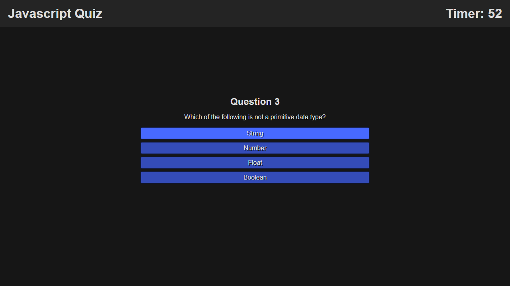

# Javascript Coding Quiz

## Description
A timed multiple choice quiz app, with the ability to store high scores locally. When you click "start", a 60 second timer starts. Answer as many questions correct before time runs out. The penalty for an incorrect answer is 10 seconds deducted from the timer. For each correct answer, 10 points is added to your score. After the timer runs out, or all the questions have been answered, any time remaining is added to your score, and an alert will tell you your final score. Then you will be given the opportunity to add your name, and it will be logged to the table of highscores.

## Background
After learning some more advanced Javascript, I decided it was time to make my own simple game. I chose the quiz format because it would allow me to practice what I've learned.

## Link
[Click here to see the finished site.](https://jcpickens0215.github.io/Coding-Quiz/)

## Screenshot
